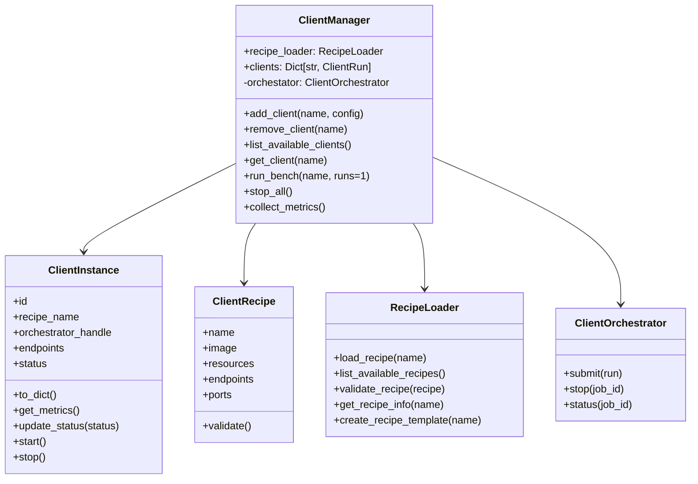
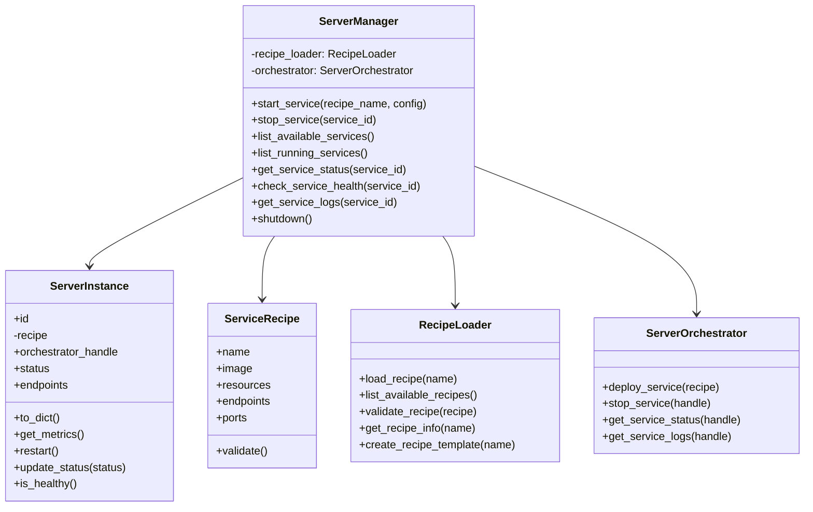
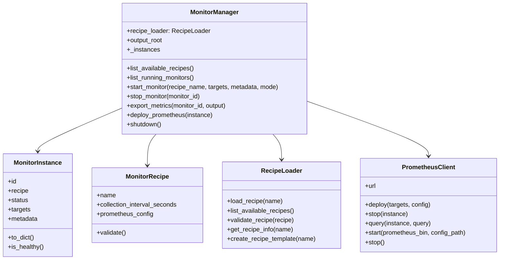

# Student Challenge 2025-2026 (Benchmarking AI Factories on MeluXina supercomputer)

The objective of this challenge is to prepare students for the upcoming AI Factories in the European Union. These AI Factories will harness the power of next-generation HPC and AI systems to revolutionise data processing, analytics, and model deployment. Through this challenge, students will gain practical skills in AI benchmarking, system monitoring, and real-world deployment scenarios—equipping them to design and operate future AI Factory workflows at scale.

## Quick Start

```bash
# 1. Install dependencies
pip install -r requirements.txt

# 2. Create .env file  with your SLURM account details
# Check out .env.example for info
nano .env

# 3. Start benchmark (example)
python -m server run --recipe example-server
python -m client run --recipe chroma-client
python -m monitor run --output results/chroma.json

```

### Server CLI quick tour

With the newly implemented server module you can explore the available recipes
and deploy them via the CLI:

```bash
# Discover recipes stored under recipes/servers
python -m server list

# Inspect metadata about a specific recipe
python -m server info --recipe example-server

# Launch one or more instances using SLURM
python -m server run --recipe example-server --count 2

# Tear down running instances
python -m server stop-all
```

## Setup

### Requirements

Install dependencies:

```bash
pip install -r requirements.txt
```

#### Client Module



#### Server module



#### Monitor module



## Team 3 — EUMASTER4HPC2526

- Edoardo Leali
- Emanuele Caruso
- Tommaso Crippa
